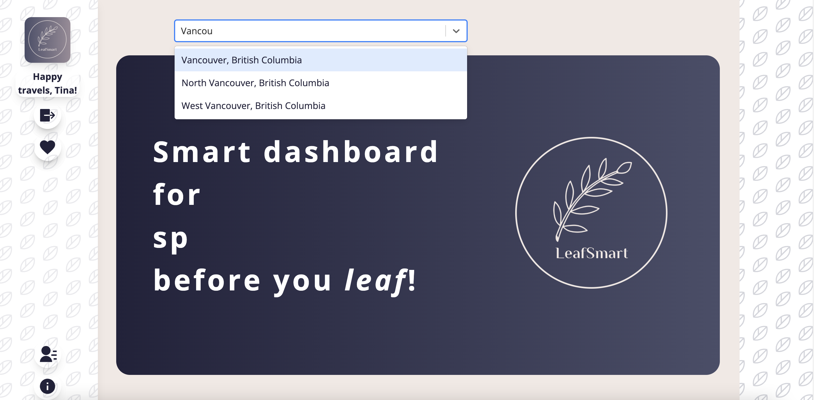
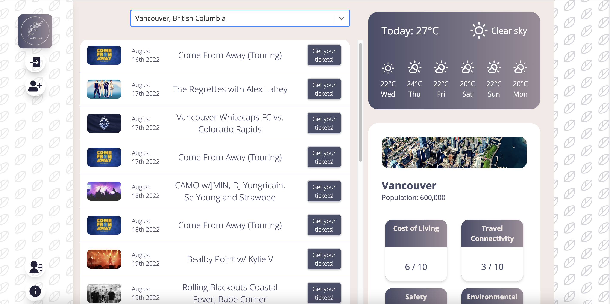
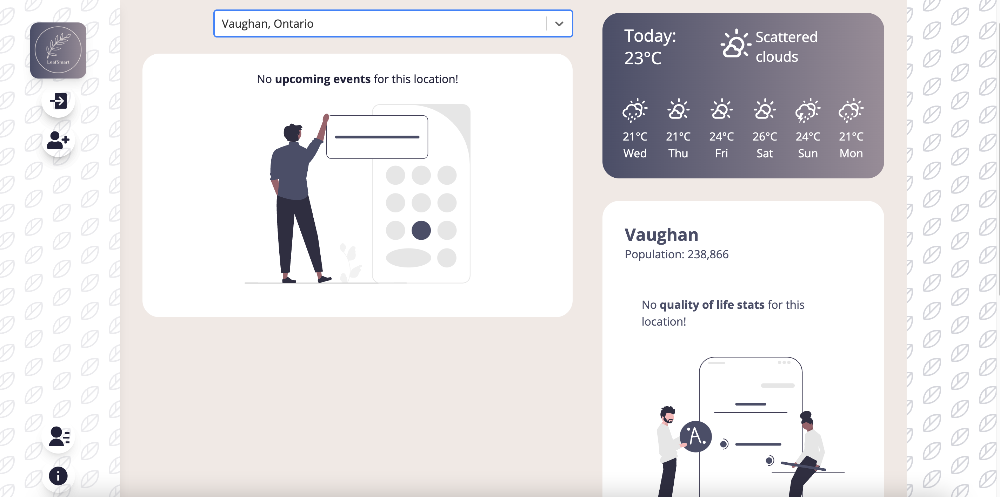
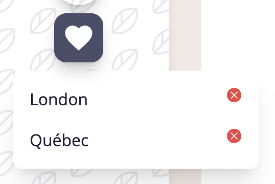
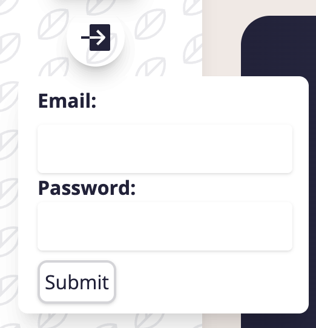
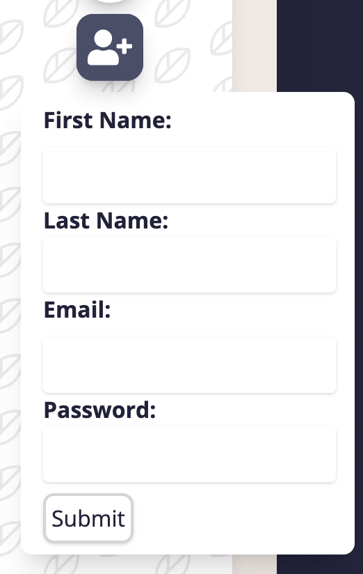
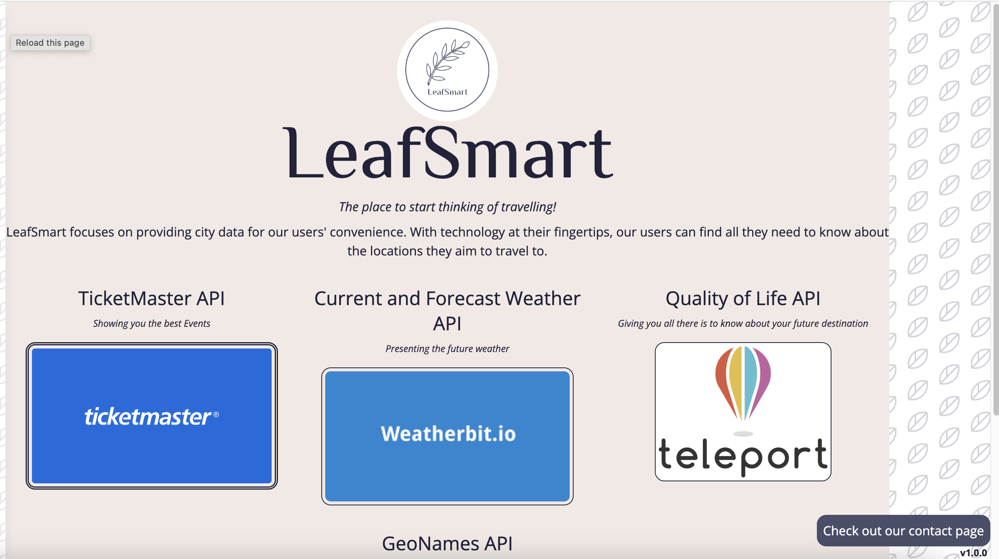

# LeafSmart

LeafSmart is an app that lets user search for a city they plan on visiting. Upon searching, the main dashboard will show 3 widgets; for upcoming events, quality of life data, and weather for that city. 

Users have the ability to add a particular city search to their favourites, as well as remove it. 

The front of this project is built with React and Tailwind. The app makes requests to the Teleport API for city data, Ticketmaster API for event data, Weatherbit API for weather data, GeoNames API for city search data, and our own API that holds user information.

## Screenshots

### Welcome page

### Typing a city

### Searched city

### Empty results

### Favourites

### Login pop-up

### Registration pop-up

### About page

### Contact page

## Dependencies
- react
- react-router-dom
- react-scripts
- axios
- jwt
- moment
- react-icons
- react-dom
- react-ts-typewriter
- react-select-async-paginate
- react-number-format
- tailwind

## Setup

1. Obtain API keys
- Geonames:
  - Register here and confirm email:http://www.geonames.org/login
  - Enable Free web services here: https://www.geonames.org/manageaccount

- Ticketmaster
  - Sign up and documentation available here: https://developer.ticketmaster.com/

- Weatherbit
  - Sign up for an account here: https://www.weatherbit.io/account/create

2. Update .env file with API keys

3. Install dependencies with `npm install`.

## Running Development Server

1. In the project directory, you can run: `npm start`
Open [http://localhost:3002](http://localhost:3002) to view it in your browser.

## LeafSmart-back-end

## Available Scripts
### `npm start`
This script runs the server with [nodemon](https://www.npmjs.com/package//nodemon)

### `npm run db:reset`
This script runs the contents of /db/schema and /db/seeds against the pg database -- either local, or if the server's been deployed to a URL, to that URL.
